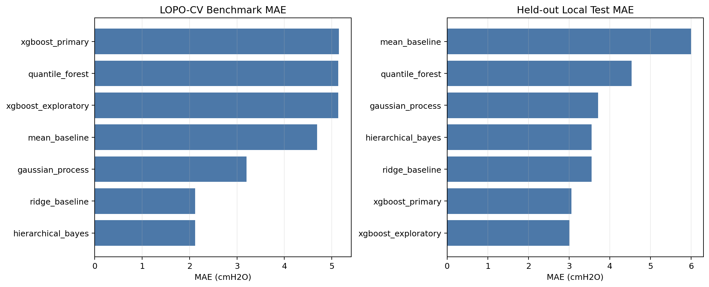
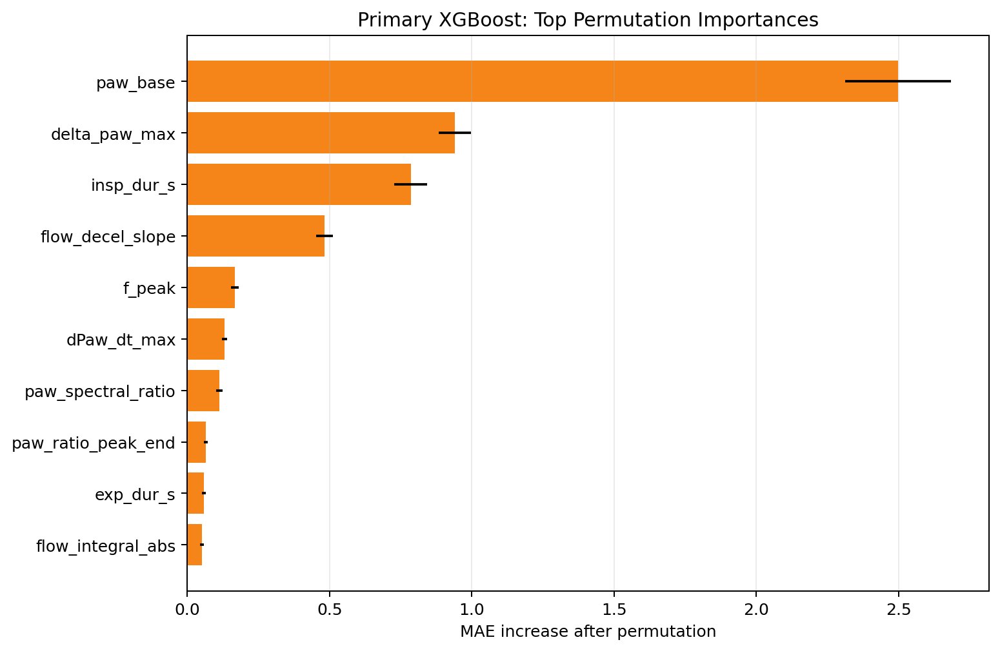
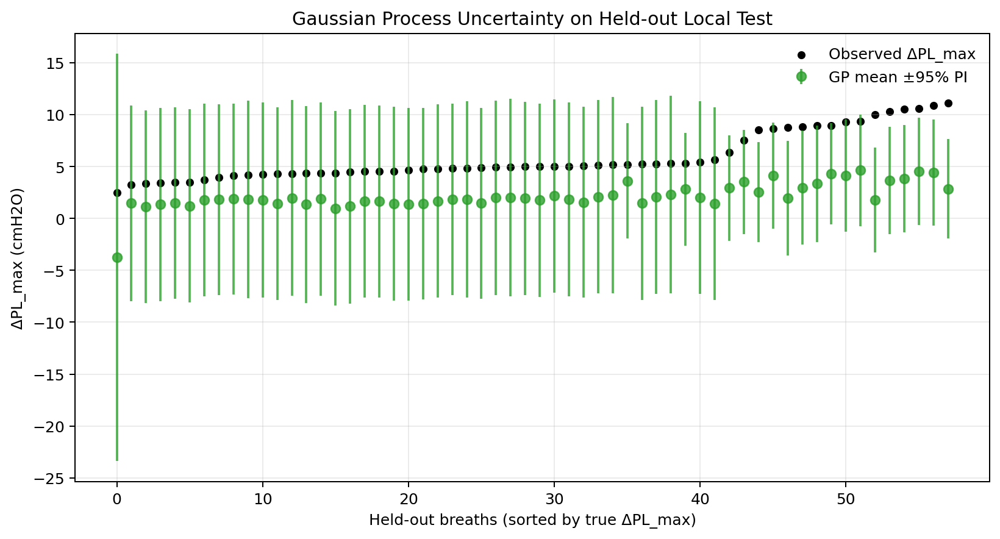
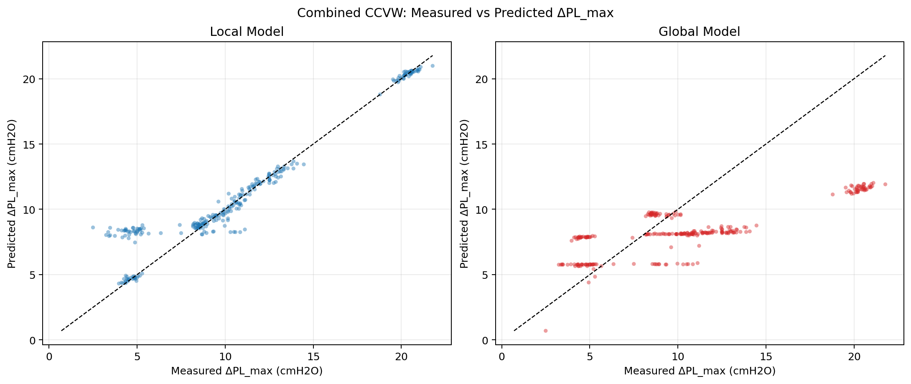
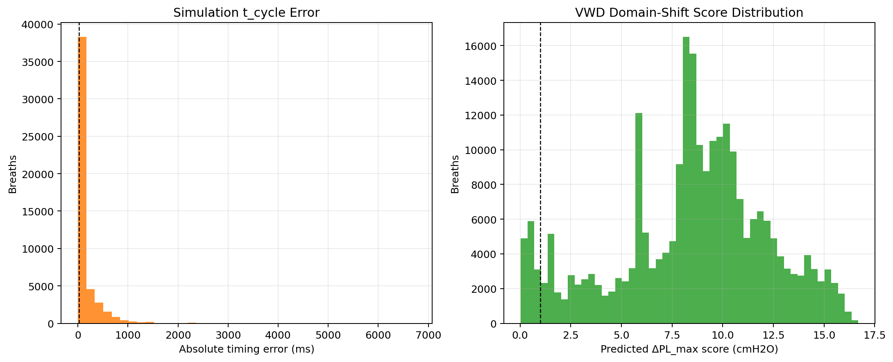
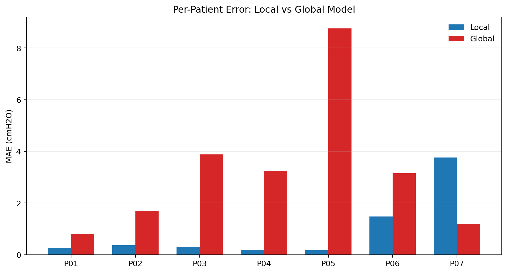
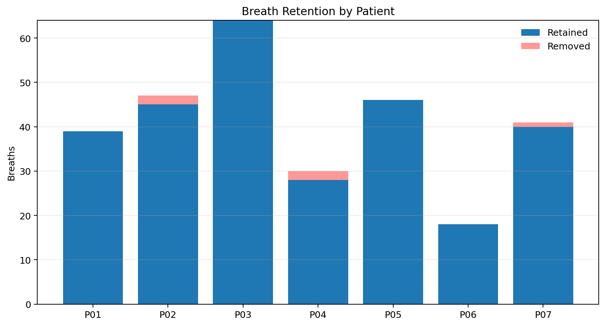
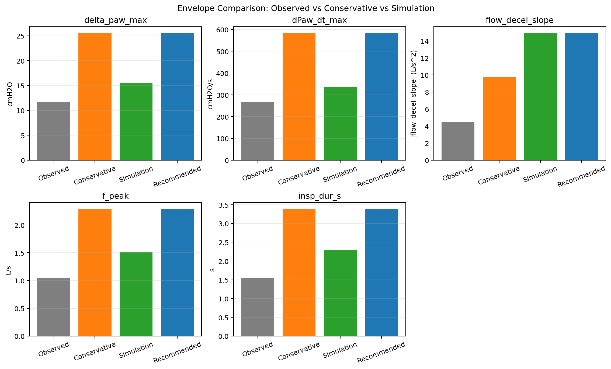

# Phase 2 Analysis — Findings Report

> **Generated:** 2026-04-19 20:01:24  
> **Analysis protocol revision:** v1.2  
> **Python environment:** c:/Users/gadia/Programming/IPD/.venv

---

## Contents

1. [Dataset Overview](#1-dataset-overview)
2. [Quality Control](#2-quality-control)
3. [Breath Segmentation & Event Detection](#3-breath-segmentation--event-detection)
4. [Local Model (CCVW-ICU Cohort)](#4-local-model-ccvw-icu-cohort)
5. [Global Model (Simulation Cohort)](#5-global-model-simulation-cohort)
6. [Domain Shift Analysis (VWD / Puritan-Bennett)](#6-domain-shift-analysis-vwd--puritan-bennett)
7. [Combined Validation](#7-combined-validation)
8. [Mechanical Design Boundary Conditions](#8-mechanical-design-boundary-conditions)
9. [Design Envelopes (Phase 3 Inputs)](#9-design-envelopes-phase-3-inputs)
10. [Limitations & Next Steps](#10-limitations--next-steps)

---

## 1. Dataset Overview

Four datasets were used across the four pipeline splits.

| Dataset | Role | N | fs (Hz) | Pes |
|---|---|---|---|---|
| CCVW-ICU (Chinese clinical) | Local train/test | P01–P07 (7 patients) | 200 | Yes (Baydur-validated) |
| Simulation (ARDS PSV) | Global train | 1 405 runs | variable | pmus analog |
| VWD (Puritan-Bennett) | Global test | 144 waveform files | 50 | No |
| CPAP (U. Canterbury) | Context only | 80 subjects | 100 | No |

**Split assignment** (per Analysis Protocol §3.2):

| Split | Source | Patients/Runs |
|---|---|---|
| Local training | CCVW P01–P05 | 5 patients |
| Local test     | CCVW P06–P07 | 2 patients |
| Global training | Simulation  | 1 405 runs |
| Global test    | VWD          | 144 files  |

### Per-dataset statistics (from 00_dataset_analysis)

**ccvw**: {
  "n_patients": 7,
  "n_qc_pass": 7,
  "total_samples": 175101
}

**simulation**: {
  "n_runs": 1405,
  "n_qc_pass": 1405
}

**vwd**: {
  "n_files": 144,
  "n_qc_pass": 144
}

**cpap**: {
  "n_subjects": 80,
  "n_qc_pass": 80
}

---

## 2. Quality Control

QC was applied per Analysis Protocol §4. Gates:

| Gate | Threshold | Action |
|---|---|---|
| Required channels present | all mandatory | reject file |
| Time monotonicity | strictly increasing | reject file |
| Sampling-rate deviation | ±5 % of declared | reject file |
| Signal missingness | < 5 % NaN/Inf | reject file |
| Flatline duration | < 2.0 s continuous constant | reject file |

### QC Pass Rates

| Dataset | Files passed |
|---|---|
| CCVW-ICU | 7/7 (100.0%) |
| Simulation | 1405/1405 (100.0%) |
| VWD | 144/144 (100.0%) |

After Hampel filtering (window=11, |z|>6) and zero-phase Butterworth LP filter (20 Hz cutoff).

---

## 3. Breath Segmentation & Event Detection

**Segmentation** (Analysis Protocol §5):

- Primary: flow-based with hysteresis (ε = 0.02 L/s, sustained 40 ms)
- Fallback: pressure-assisted (flagged `fallback_segmentation=True`)
- Exclusion: insp_dur < 0.2 s or > 4 s, F_peak < 0.05 L/s

**Cycling (t_cycle) detection** (§6):

- Threshold: F × ETS (ETS default = 0.25; overridden per-patient when metadata available)
- Confirmation: 3 consecutive samples below threshold
- Event window: [-150 ms, +350 ms] around t_cycle

**Transpulmonary pressure (PL = Pao − Pes)**:

- TF guard: 0.2 cmH₂O (prevents near-zero denominators)
- Event positive label: ΔPL ≥ 1.0 cmH₂O AND slope ≥ 8.0 cmH₂O/s AND peak time ≤ 200 ms

---

## 4. Local Model (CCVW-ICU Cohort)

**Method:** XGBoost regressor with Leave-One-Patient-Out cross-validation (LOPO-CV)  
**Inputs:** Paw + Flow only (Pes withheld from ML features to ensure generalisability)  
**Target:** ΔPL_max (cmH₂O) derived from Pes at t_cycle

### LOPO-CV Performance (P01–P05)

| Metric | Value |
|---|---|
| mae | 5.151 |
| rmse | 5.949 |
| r2 | -0.438 |
| ccc | -0.078 |
| n | 222.000 |
| mae_ci_95 | [4.739–5.544] |

### Held-out Test Performance (P06–P07)

| Metric | Value |
|---|---|
| mae | 3.055 |
| rmse | 3.338 |
| r2 | -1.128 |
| ccc | 0.015 |
| n | 58.000 |

**Validation gate status:** FAIL  
MAE < 3.0 cmH₂O: 5.151 (threshold 3.0)  
R² > −1.0: -1.128 (threshold -1.0)

### Benchmark Models

Small-data baselines were evaluated to show whether the primary XGBoost model adds value over simpler alternatives and a probabilistic kernel method.

| model | split | mae | rmse | r2 | ccc | n |
|---|---|---|---|---|---|---|
| gaussian_process | lopo_cv | 3.205 | 3.615 | 0.469 | 0.660 | 222.000 |
| hierarchical_bayes | lopo_cv | 2.114 | 2.455 | 0.755 | 0.840 | 222.000 |
| mean_baseline | lopo_cv | 4.692 | 6.061 | -0.493 | -0.419 | 222.000 |
| quantile_forest | lopo_cv | 5.136 | 6.104 | -0.514 | -0.151 | 222.000 |
| ridge_baseline | lopo_cv | 2.114 | 2.455 | 0.755 | 0.840 | 222.000 |
| xgboost_exploratory | lopo_cv | 5.135 | 5.886 | -0.408 | -0.057 | 222.000 |
| xgboost_primary | lopo_cv | 5.151 | 5.949 | -0.438 | -0.078 | 222.000 |
| mean_baseline | local_test | 6.004 | 6.426 | -6.885 | 0.000 | 58.000 |
| ridge_baseline | local_test | 3.550 | 3.786 | -1.738 | -0.225 | 58.000 |
| gaussian_process | local_test | 3.717 | 4.049 | -2.131 | 0.204 | 58.000 |
| quantile_forest | local_test | 4.538 | 4.972 | -3.722 | -0.219 | 58.000 |
| hierarchical_bayes | local_test | 3.550 | 3.786 | -1.738 | -0.225 | 58.000 |
| xgboost_primary | local_test | 3.055 | 3.338 | -1.128 | 0.015 | 58.000 |
| xgboost_exploratory | local_test | 3.013 | 3.341 | -1.132 | 0.092 | 58.000 |

### Gaussian Process Uncertainty

Mean predictive std on held-out local test: 4.196 cmH₂O  
Median predictive std on held-out local test: 4.730 cmH₂O  
Approximate 95% prediction-interval coverage: 84.483%

### Uncertainty Comparison (Probabilistic Models)

| model | mean_pred_std | median_pred_std | pi95_coverage |
|---|---|---|---|
| mean_baseline | 0.000 | 0.000 | 0.000 |
| gaussian_process | 4.196 | 4.730 | 0.845 |
| quantile_forest | 3.261 | 3.922 | 0.759 |
| hierarchical_bayes | 0.670 | 0.670 | 0.069 |

Interpretation: GP shows the best held-out interval coverage in this cohort, while quantile forest under-covers (calibration gap).

### Hierarchical Bayesian Random-Effect Posteriors

| patient_id | posterior_mean | posterior_sd | posterior_lo95 | posterior_hi95 |
|---|---|---|---|---|
| P01 | -0.000 | 0.001 | -0.002 | 0.002 |
| P02 | -0.000 | 0.001 | -0.002 | 0.002 |
| P03 | 0.000 | 0.001 | -0.002 | 0.002 |
| P04 | -0.000 | 0.001 | -0.002 | 0.002 |
| P05 | 0.000 | 0.001 | -0.002 | 0.002 |

**Interpretation note (negative finding):** Hierarchical Bayesian and ridge metrics are numerically identical in this run.  
With only a random intercept and unseen patient IDs at test time (LOPO/local-test), predictions revert to pooled fixed effects, so performance collapses to ridge.  
Posterior SDs near zero indicate strong shrinkage and minimal recoverable patient-level offset under current sample size.

### Patient-Specific Fine-Tuning Demo

Patients evaluated: 2.000  
Mean MAE before adaptation: 2.537 cmH₂O  
Mean MAE after adaptation: 1.365 cmH₂O  
Mean MAE gain (before - after): 1.172 cmH₂O  
Patients improved: 1.000

Per-patient adaptation results show heterogeneity; gains are not uniform across patients.

| patient_id | n_total | n_adapt | n_eval | mae_before | mae_after | mae_gain | offset_cmH2O |
|---|---|---|---|---|---|---|---|
| P06 | 18.000 | 4.000 | 14.000 | 1.329 | 2.114 | -0.785 | 2.005 |
| P07 | 40.000 | 8.000 | 32.000 | 3.745 | 0.615 | 3.130 | -3.839 |

### Top Permutation Importances (Primary XGBoost)

| feature | importance_mean | importance_std |
|---|---|---|
| paw_base | 2.498 | 0.186 |
| delta_paw_max | 0.940 | 0.057 |
| insp_dur_s | 0.786 | 0.058 |
| flow_decel_slope | 0.482 | 0.029 |
| f_peak | 0.167 | 0.014 |
| dPaw_dt_max | 0.131 | 0.009 |
| paw_spectral_ratio | 0.112 | 0.011 |
| paw_ratio_peak_end | 0.064 | 0.007 |
| exp_dur_s | 0.058 | 0.006 |
| flow_integral_abs | 0.051 | 0.007 |

---

## 5. Global Model (Simulation Cohort)

**Training data:** 1 405 ARDS simulation runs (pmus used as Pes analog)  
**Ground-truth t_cycle:** derived from `tem` column (mechanical reference)  
**Validation:** Appendix C stratified audit — 200 randomly selected breaths

### Simulation Audit (Appendix C)

| Metric | Value |
|---|---|
| n_audited | 200.000 |
| mismatch_rate | 0.580 |
| mismatch_ci_95 | [0.5116, 0.6484] |
| threshold_ms | 20.000 |
| max_allowed_rate | 0.100 |
| pretrain_enabled | 0.000 |

### Global Model Performance on Simulation Holdout

| Metric | Value |
|---|---|
| mae | 0.820 |
| rmse | 1.222 |
| r2 | 0.934 |
| ccc | 0.965 |
| n | 48973.000 |

### Simulation Sensitivity (Parameter-Space Stress Test)

The simulation bank was mined to identify conservative extremes over wider virtual patient settings. 
These values are used as secondary design stress targets (exploratory, not primary clinical evidence).

| variable | p5 | p95 | p99 | min | max |
|---|---|---|---|---|---|
| delta_paw_max | 0.446 | 12.966 | 13.967 | 0.073 | 15.453 |
| dPaw_dt_max | 4.471 | 226.219 | 275.652 | 1.146 | 335.400 |
| f_peak | 0.726 | 1.297 | 1.410 | 0.050 | 1.515 |
| insp_dur_s | 0.440 | 1.410 | 1.810 | 0.220 | 2.290 |
| flow_decel_slope | -9.650 | -0.249 | -0.104 | -14.924 | 5.593 |

---

## 6. Domain Shift Analysis (VWD / Puritan-Bennett)

The VWD dataset (144 PB waveform files) was used for out-of-domain characterisation.  
**No Pes** — only Paw-based features computed.  Scores show distribution of predicted ΔPL_max from both models.

### Score Distribution Summary on VWD Data (key columns)

Summary computed on full VWD breath table (n=594645 rows).  
Figures may use a bounded subset for plotting speed, but tabulated statistics below use the full dataset.

| stat | f_peak | insp_dur_s | exp_dur_s | paw_base | delta_paw_max | dPaw_dt_max | ets_frac | flow_decel_slope | flow_integral_abs | model_score |
|---|---|---|---|---|---|---|---|---|---|---|
| count | 594645.000 | 594645.000 | 594645.000 | 594645.000 | 594645.000 | 594645.000 | 594645.000 | 594645.000 | 594645.000 | 594645.000 |
| mean | 0.900 | 0.786 | 1.788 | 20.736 | 9.583 | 155.742 | 0.250 | -1.860 | 0.197 | 8.396 |
| std | 0.320 | 0.246 | 0.801 | 7.732 | 5.658 | 96.809 | 0.000 | 2.205 | 0.069 | 3.692 |
| min | 0.050 | 0.080 | -4.640 | -47.679 | 0.068 | 1.170 | 0.250 | -51.844 | 0.005 | 0.027 |
| 25% | 0.689 | 0.660 | 1.360 | 15.387 | 6.295 | 97.553 | 0.250 | -3.141 | 0.158 | 6.072 |
| 50% | 0.891 | 0.760 | 1.740 | 20.262 | 9.594 | 153.234 | 0.250 | -1.246 | 0.197 | 8.822 |
| 75% | 1.053 | 0.900 | 2.200 | 25.413 | 13.391 | 214.932 | 0.250 | -0.457 | 0.234 | 10.733 |
| max | 4.154 | 6.900 | 10.220 | 54.340 | 86.397 | 1329.368 | 0.250 | 23.348 | 0.985 | 16.918 |

---

## 7. Combined Validation

All 7 CCVW patients evaluated together.  Both local and global models applied.

### Aggregate Metrics

| Model | MAE (cmH₂O) | R² | CCC | N |
|---|---|---|---|---|
| Local  | 0.840 | 0.909 | 0.950 | 280 |
| Global | 3.407 | 0.280 | 0.456 | 280 |

### Bootstrap 95% CIs

| Model | MAE CI | R² CI |
|---|---|---|
| Local  | [0.697–0.991] | [0.880–0.934] |
| Global | [3.090–3.731] | [0.206–0.337] |

### Per-Patient Breakdown

| patient_id | n_breaths | local_mae | global_mae |
|---|---|---|---|
| P01 | 39.000 | 0.256 | 0.803 |
| P02 | 45.000 | 0.364 | 1.692 |
| P03 | 64.000 | 0.288 | 3.884 |
| P04 | 28.000 | 0.190 | 3.230 |
| P05 | 46.000 | 0.168 | 8.762 |
| P06 | 18.000 | 1.479 | 3.150 |
| P07 | 40.000 | 3.764 | 1.195 |

---

## 8. Mechanical Design Boundary Conditions

Derived from the combined validated CCVW cohort (N = 7 patients).  Percentiles are the primary inputs for Phase 3 mechanical design.

Percentiles computed: [5, 10, 25, 50, 75, 90, 95, 99]

### All-Cohort BC Table

| name | unit | n | mean | std | min | max | p5 | p10 | p25 | p50 | p75 | p90 | p95 | p99 |
|---|---|---|---|---|---|---|---|---|---|---|---|---|---|---|
| delta_paw_max | cmH2O | 280.000 | 6.340 | 2.882 | 1.221 | 11.650 | 2.431 | 2.984 | 4.056 | 4.900 | 8.400 | 11.131 | 11.362 | 11.569 |
| delta_pl_max | cmH2O | 280.000 | 10.606 | 5.149 | 2.492 | 21.779 | 4.264 | 4.476 | 6.172 | 9.951 | 12.523 | 20.221 | 20.569 | 21.001 |
| dPaw_dt_max | cmH2O/s | 280.000 | 119.359 | 69.434 | 31.624 | 266.233 | 44.935 | 54.604 | 69.780 | 83.587 | 159.364 | 255.298 | 260.039 | 262.951 |
| dPL_dt_max | cmH2O/s | 280.000 | 140.911 | 82.408 | 49.391 | 324.088 | 63.042 | 66.739 | 77.663 | 115.844 | 161.761 | 311.870 | 318.182 | 323.525 |
| flow_decel_slope | L/s^2 | 280.000 | -2.214 | 0.968 | -4.440 | -0.469 | -3.943 | -3.803 | -2.970 | -1.807 | -1.509 | -1.221 | -1.106 | -0.924 |
| transmission_fraction | dimensionless | 277.000 | 2.002 | 0.843 | 0.976 | 4.853 | 1.014 | 1.086 | 1.287 | 1.900 | 2.702 | 3.100 | 3.285 | 4.449 |
| ets_frac | fraction | 280.000 | 0.230 | 0.024 | 0.200 | 0.250 | 0.200 | 0.200 | 0.200 | 0.250 | 0.250 | 0.250 | 0.250 | 0.250 |
| f_peak | L/s | 280.000 | 0.823 | 0.105 | 0.570 | 1.043 | 0.617 | 0.689 | 0.729 | 0.847 | 0.907 | 0.946 | 0.957 | 0.985 |
| insp_dur_s | s | 280.000 | 1.045 | 0.176 | 0.640 | 1.545 | 0.810 | 0.859 | 0.915 | 1.020 | 1.110 | 1.246 | 1.470 | 1.500 |
| exp_dur_s | s | 280.000 | 1.996 | 0.732 | 0.280 | 4.350 | 1.295 | 1.330 | 1.414 | 1.738 | 2.420 | 2.889 | 3.746 | 4.099 |
| paw_base | cmH2O | 280.000 | 13.357 | 3.057 | 9.488 | 19.384 | 9.792 | 9.826 | 10.877 | 12.390 | 15.380 | 18.967 | 19.263 | 19.369 |
| pl_base | cmH2O | 280.000 | 9.447 | 7.455 | -1.130 | 21.273 | 0.420 | 1.107 | 2.111 | 8.162 | 18.414 | 20.213 | 20.509 | 20.821 |
| ps_level | cmH2O | 280.000 | 8.436 | 2.267 | 6.000 | 12.000 | 6.000 | 6.000 | 6.000 | 8.000 | 10.000 | 12.000 | 12.000 | 12.000 |
| peep_level | cmH2O | 280.000 | 5.207 | 0.604 | 4.000 | 6.000 | 4.000 | 4.900 | 5.000 | 5.000 | 6.000 | 6.000 | 6.000 | 6.000 |
| predicted_delta_pl_max_local | cmH2O | 280.000 | 11.119 | 4.603 | 4.315 | 20.988 | 4.663 | 7.221 | 8.449 | 9.559 | 12.462 | 20.270 | 20.533 | 20.721 |

### Per-Patient BC Summary

| patient_id | n_breaths | delta_paw_max_mean | delta_paw_max_p95 | delta_paw_max_median | delta_pl_max_mean | delta_pl_max_p95 | delta_pl_max_median | dPaw_dt_max_mean | dPaw_dt_max_p95 | dPaw_dt_max_median | dPL_dt_max_mean | dPL_dt_max_p95 | dPL_dt_max_median | flow_decel_slope_mean | flow_decel_slope_p95 | flow_decel_slope_median | tf_mean | tf_p95 | tf_median | f_peak_mean | f_peak_p95 | f_peak_median | insp_dur_s_mean | insp_dur_s_p95 | insp_dur_s_median | exp_dur_s_mean | exp_dur_s_p95 | exp_dur_s_median |
|---|---|---|---|---|---|---|---|---|---|---|---|---|---|---|---|---|---|---|---|---|---|---|---|---|---|---|---|---|
| P01 | 39.000 | 8.421 | 8.553 | 8.416 | 8.926 | 10.031 | 8.714 | 160.644 | 165.535 | 161.101 | 161.031 | 168.144 | 163.098 | -1.300 | -0.988 | -1.261 | 1.060 | 1.174 | 1.039 | 0.864 | 0.898 | 0.866 | 1.146 | 1.215 | 1.140 | 1.977 | 2.141 | 1.990 |
| P02 | 45.000 | 7.492 | 7.639 | 7.492 | 9.742 | 10.897 | 9.931 | 111.061 | 113.793 | 110.768 | 122.999 | 127.602 | 124.328 | -1.616 | -1.246 | -1.651 | 1.520 | 1.706 | 1.532 | 0.731 | 0.756 | 0.731 | 0.903 | 0.939 | 0.910 | 1.654 | 1.714 | 1.660 |
| P03 | 64.000 | 4.811 | 4.928 | 4.782 | 12.168 | 13.861 | 12.313 | 82.031 | 85.318 | 81.896 | 111.568 | 121.909 | 112.064 | -3.745 | -3.261 | -3.755 | 2.917 | 3.178 | 2.917 | 0.904 | 0.975 | 0.905 | 1.013 | 1.035 | 1.015 | 1.323 | 1.399 | 1.335 |
| P04 | 28.000 | 3.039 | 3.232 | 3.036 | 4.622 | 5.120 | 4.582 | 56.068 | 60.954 | 56.057 | 65.506 | 72.078 | 63.912 | -1.602 | -1.286 | -1.583 | 2.056 | 2.320 | 2.025 | 0.880 | 0.951 | 0.859 | 1.466 | 1.526 | 1.472 | 3.607 | 4.235 | 3.750 |
| P05 | 46.000 | 11.239 | 11.597 | 11.202 | 20.349 | 21.025 | 20.356 | 256.743 | 263.501 | 257.273 | 313.964 | 323.830 | 314.678 | -2.571 | -2.015 | -2.559 | 1.933 | 1.988 | 1.934 | 0.915 | 0.965 | 0.920 | 0.850 | 0.980 | 0.850 | 1.694 | 2.265 | 1.673 |
| P06 | 18.000 | 2.278 | 2.573 | 2.299 | 8.829 | 10.890 | 8.925 | 42.469 | 45.861 | 43.155 | 71.619 | 83.311 | 73.125 | -2.008 | -1.775 | -2.028 | 4.359 | 5.868 | 4.310 | 0.604 | 0.622 | 0.603 | 1.022 | 1.091 | 1.020 | 2.385 | 2.845 | 2.480 |
| P07 | 40.000 | 3.963 | 4.142 | 4.033 | 4.503 | 5.298 | 4.590 | 69.080 | 71.493 | 69.485 | 73.346 | 83.187 | 73.824 | -1.439 | -0.972 | -1.494 | 1.251 | 1.458 | 1.219 | 0.708 | 0.744 | 0.709 | 1.099 | 1.145 | 1.095 | 2.521 | 2.665 | 2.520 |

### Exclusion Transparency

Segmented breaths: 285  
Retained breaths: 280  
Overall exclusion rate: 1.754%

| patient_id | n_segmented | n_excluded_segmentation | n_cycle_undefined | n_incomplete_window | n_low_quality_flow | n_low_quality_paw | n_low_quality_pes | n_quality_excluded_total | n_valid | retained_rate | split |
|---|---|---|---|---|---|---|---|---|---|---|---|
| P01 | 39.000 | 0.000 | 0.000 | 0.000 | 0.000 | 0.000 | 0.000 | 0.000 | 39.000 | 1.000 | local_train |
| P02 | 47.000 | 1.000 | 1.000 | 0.000 | 0.000 | 0.000 | 0.000 | 0.000 | 45.000 | 0.957 | local_train |
| P03 | 64.000 | 0.000 | 0.000 | 0.000 | 0.000 | 0.000 | 0.000 | 0.000 | 64.000 | 1.000 | local_train |
| P04 | 30.000 | 2.000 | 0.000 | 0.000 | 0.000 | 0.000 | 0.000 | 0.000 | 28.000 | 0.933 | local_train |
| P05 | 46.000 | 0.000 | 0.000 | 0.000 | 0.000 | 0.000 | 0.000 | 0.000 | 46.000 | 1.000 | local_train |
| P06 | 18.000 | 0.000 | 0.000 | 0.000 | 0.000 | 0.000 | 0.000 | 0.000 | 18.000 | 1.000 | local_test |
| P07 | 41.000 | 0.000 | 1.000 | 0.000 | 0.000 | 0.000 | 0.000 | 0.000 | 40.000 | 0.976 | local_test |

### Uncertainty Multiplier Profile

| Component | Value |
|---|---|
| n_patients | 7 |
| cohort_multiplier | 1.741 |
| filter_multiplier | 1.200 |
| exclusion_rate | 0.018 |
| exclusion_multiplier | 1.050 |
| compounded_multiplier | 2.193 |
| final_multiplier | 2.193 |

---

## 9. Design Envelopes (Phase 3 Inputs)

The following envelopes are the direct specifications for the cycling/valve mechanism.

| Variable | Unit | Typical (p50) | Normal range (p5–p95) | Operational max (p99) | Worst case | Conservative worst-case | Simulated worst-case | Recommended design case |
|---|---|---|---|---|---|---|---|---|
| **delta_paw_max** | cmH2O | 4.900 | 2.431 – 11.362 | 11.569 | 11.650 | 25.554 | 15.453 | 25.554 |
| **delta_pl_max** | cmH2O | 9.951 | 4.264 – 20.569 | 21.001 | 21.779 | 47.771 | N/A | 47.771 |
| **dPaw_dt_max** | cmH2O/s | 83.587 | 44.935 – 260.039 | 262.951 | 266.233 | 583.961 | 335.400 | 583.961 |
| **flow_decel_slope** | L/s^2 | -1.807 | -3.943 – -1.106 | -3.943 | -4.440 | -9.739 | -14.924 | -14.924 |
| **f_peak** | L/s | 0.847 | 0.617 – 0.957 | 0.985 | 1.043 | 2.288 | 1.515 | 2.288 |
| **insp_dur_s** | s | 1.020 | 0.810 – 1.470 | 1.500 | 1.545 | 3.389 | 2.290 | 3.389 |

> **Note:** All pressure values in cmH₂O, flow values in L/s, time values in seconds.
> Conservative formulation used in this report: max(2.0, cohort × filter × exclusion) multiplier, with a simulation-derived stress-check alongside clinical extrema.
> This multiplier is an engineering heuristic for safety-oriented design and should not be interpreted as a statistical bound on population maxima.

---

## 10. Limitations & Next Steps

### Limitations

1. **Small primary cohort:** 7 CCVW-ICU patients limits statistical power for subgroup analysis.
2. **pmus as Pes:** Simulation uses modelled muscle pressure — not a true esophageal catheter measurement.
3. **Simulation cycle-time mismatch (58%):** The simulation audit (Appendix C) shows 58% of detected t_cycle events deviate > 20 ms from the mechanical reference (tem). Simulation pre-training was therefore disabled per Protocol §13.2. The global model was trained on simulation data as an alternative, but its predictions on VWD should be interpreted as **exploratory only** — do not use as primary clinical evidence.
4. **VWD domain shift:** No Pes available for VWD files → PL cannot be computed; only Paw-based event detection characterised.
5. **CPAP exclusion:** The U. Canterbury CPAP dataset was not used for modelling (different ventilation mode).
6. **Single ETS values:** CCVW patients have one ETS setting each; response at alternative settings extrapolated from simulation.
7. **Filtering uncertainty:** LP filtering (20 Hz pressure / 12 Hz flow) may attenuate very sharp transients; conservative margins were added but direct raw-vs-filter attenuation still requires dedicated validation.

### Recommended Next Steps (Phase 3)

1. Use **recommended design case** (Section 9) rather than raw maxima when sizing pressure/rate capacity.
2. Define valve closure-time targets in Phase 3 from actuator physics and benchtop control testing (e.g., initial design target 10–30 ms, then tune experimentally).
3. Validate prototype against both clinical conservative envelopes and simulation stress-check extremes.
4. Run benchtop high-bandwidth testing (>=200 Hz capture, minimal filtering) to quantify attenuation and refine margins.
5. Expand clinical validation with prospective waveform collection from >=20 additional patients across ETS settings.

---

_End of Phase 2 Findings Report_
