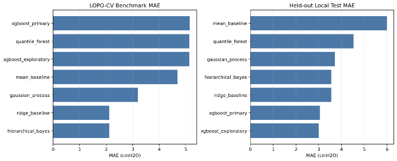
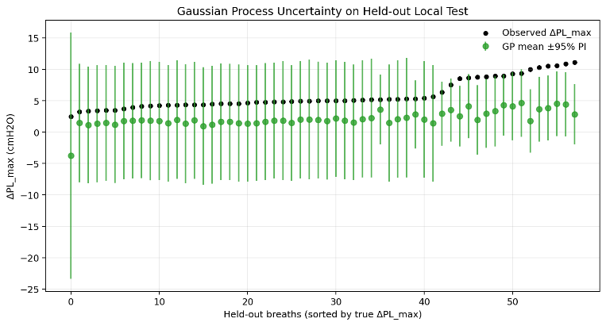
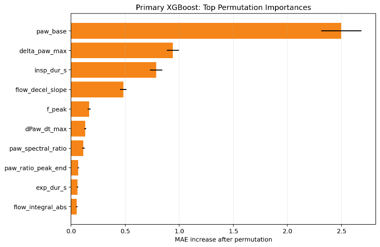
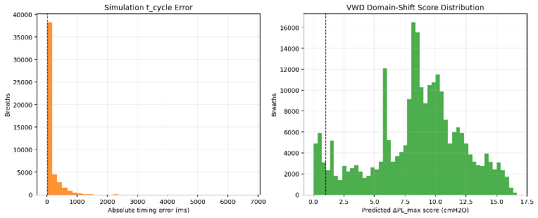
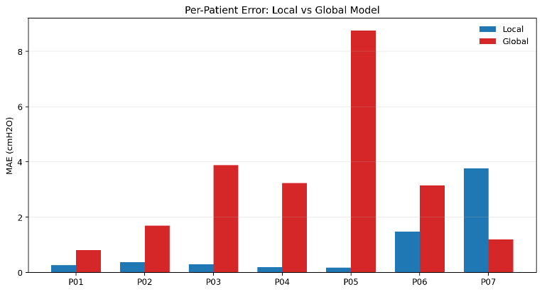
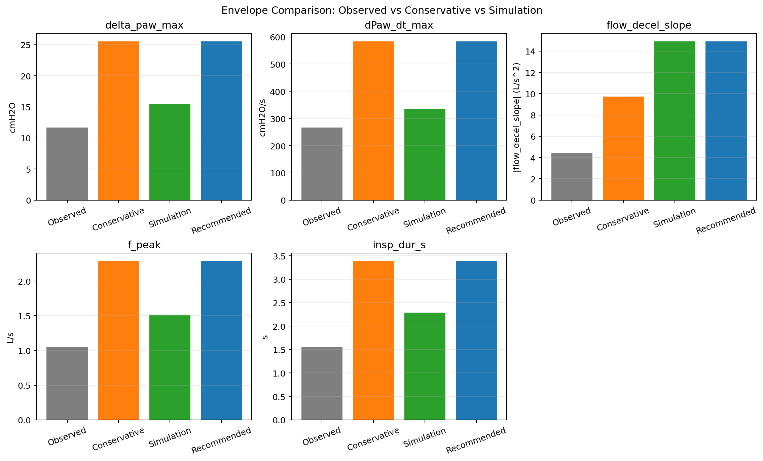
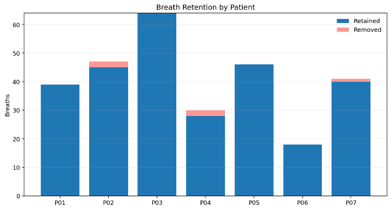

> **Physiology-Grounded** **Machine** **Learning** **for** **Detecting**
> **Flow-Termination** **Transients** **in** **Pressure** **Support**
> **Ventilation** **Using** **Transpulmonary** **Pressure**
>
> *Priyansh* *Gadia* *(Roll* *Number:* 23035010192*)*
>
> Internship / Term Project Report Trimester 7
>
> B.Sc. (Honours) Data Science and Artificial Intelligence Indian
> Institute of Technology Guwahati, India
> [<u>p.gadia@op.iitg.ac.in</u>](file:///C:/Users/gadia/Downloads/p.gadia@op.iitg.ac.in)

**ABSTRACT**

Pressure support ventilation operates its cycle through the complete
breath sequence until the inspiratory flow reaches the established
threshold value for expiring. The breathing measurement tools which
hospitals use fail to record the mechanical effects created by treatment
because they only report plateau pressure and driving pressure. The
research establishes a machine learning system which uses physiological
principles and biomechanical analysis to predict sub-second
flow-termination transients in pressure support ventilation through its
primary measurement, transpulmonary pressure. The core formulation
defines transpulmonary pressure as the difference between airway opening
pressure and esophageal pressure thus providing a direct method to
measure mechanical stress during the ventilator cycling.

The research team created waveform analysis through their study of
particular pressure support ventilation patients who had both airway
pressure and flow measurements taken together fromA. Baydur’s esophageal
pressure records at a frequency of 200 Hz. The researchers divided
breaths into segments according to specific hysteresis-based rules which
established deterministic cycling at the expiratory trigger point, while
post-cycling transient magnitude measurement utilized peak changes in
both airway and transpulmonary pressure during short observation
windows. The research team chose to restrict machine learning model
development to non-invasive waveform features because they wanted to
create a predictive system which could function without esophageal
pressure access. The researchers conducted external stress testing
through the use of simulated waveforms while domain-shift testing was
done on an actual dataset which lacked esophageal pressure measurement.

The research presents its main methodological contribution through the
development of the first ventilator-event modeling framework which uses
esophageal pressure data to create physiological ground truth for the
problem sector. The research verified that cycling-related transients
could be detected through measurement methods which researchers could
analyze using systematic parameterization. The cohort showed positive
results through its combined performance results yet patient performance
during the held-out testing showed different results which showed that
patient performance testing needs more development work. Simulation
pre-training could not serve as primary evidence because the timing
difference between simulation and clinical testing was too large. The
research results demonstrate that the scientific

phenomenon has validity through its physiological-grounded modeling
system while showing that clinical implementation needs both larger
multi-patient datasets and more extensive external validation.

***Index*** ***Terms*** — Pressure support ventilation; transpulmonary
pressure; esophageal pressure; flow cycling; ventilator waveform
analysis; physiology-grounded machine learning; patient-ventilator
interaction; biomechanical signal analysis

**1.** **INTRODUCTION**

Pressure support ventilation (PSV) is widely used in critical care
because it allows partial patient effort while providing ventilatory
assistance. The system in PSV uses a flow-based cycling rule to
determine when the patient should stop inhaling and start exhaling
instead of using fixed times for breathing or specific amounts of air.
The cycling moment becomes mechanically crucial because even a tiny
difference between how much a patient pushes themselves and how much the
ventilator supports them will lead to immediate changes in airway
pressure and flow. The duration of these events falls short of typical
summary metrics which include plateau pressure, mean airway pressure,
and driving pressure.

The transients which occur during ventilation create their medical
issues because they will create their maximum force in specific
locations.Airway pressure alone does not distinguish between pressure
dissipated in the chest wall and pressure transmitted to the lung. The
current research focuses on transpulmonary pressure which scientists
define as:

> 𝑃(𝑡) = 𝑃𝑤(𝑡) − 𝑃𝑠(𝑡)

where 𝑃𝑤 is airway opening pressure and 𝑃𝑠 is esophageal pressure. The
formulation produces an estimate of lung-facing mechanical stress based
on physiological principles which describe how breathing through a
ventilator creates mechanical ventilation stress.

The research area of artificial intelligence interprets ventilator
waveforms however previous models used visual labels or indirect
surrogate endpoints instead of machine learning approaches. The method
works effectively but it creates problems for maintaining biological
accuracy during quick events which happen close to the

> boundary of cycling. The project introduces a new machine learning
> approach which uses transpulmonary pressure from esophageal-pressure
> data as its primary reference for developing machine learning targets.
> The study changes its assessment focus from abnormal waveform
> detection to prediction of lung-level mechanical effects which emerge
> from the detected abnormal waveforms.
>
> The project advances through its current stage by working toward two
> related goals. The first is to characterize flow-termination
> transients in PSV using high-resolution waveform analysis and
> pre-specified biomechanical definitions. The second part of the study
> tests whether non-invasive waveform features can accurately predict
> transpulmonary transients which will be used for future bedside
> detection. The initial findings demonstrate that researchers can
> measure the phenomenon but connecting results between different
> patients presents a major challenge for research. The problem retains
> its scientific value while offering practical benefits which make it
> worthwhile to study.
>
> **2.** **PROBLEM** **STATEMENTAND** **OBJECTIVES**

**2.1.** **Problem** **Statement**

> The system uses a flow-cycling rule to determine when a breath ends
> instead of using a fixed time for breathing. The ventilator system
> stops functioning when the patient reaches the sensitivity threshold
> for active breathing, which causes an immediate mechanical shift that
> results in a brief pressure change. Current bedside monitoring systems
> can only detect this particular event because the critical safety
> metrics which include plateau pressure and driving pressure must meet
> their established standards during static and near-static states that
> occur after active flow has stopped. The system fails to measure lung
> stress during the transition from inhalation to exhalation because it
> lacks the ability to detect this important physiological process
> during standard medical procedures.
>
> The machine learning problem follows from this physiological framing.
> Existing ventilator waveform models typically depend on clinician
> visual labels or broad asynchrony categories, which are insufficient
> for a short-lived event occurring at the exact cycling moment. The
> main machine learning task requires estimating transpulmonary
> transient magnitude through non-invasive airway pressure and flow
> waveform features, while using esophageal pressure measurements as
> reference data. The secondary task requires determining whether a
> breath contains a physiologically significant event under
> pre-specified criteria.
>
> Hence, we define the problem statement as:
>
> *“Creating* *machine* *learning* *models* *which* *can* *explain*
> *their* *predictions* *while* *handling* *uncertain* *situations* *to*
> *predict* *transpulmonary* *pressure* *changes* *which* *occur*
> *during* *pressure* *support* *ventilation* *flow* *termination* *by*
> *using* *non-invasive* *airway* *pressure* *and* *flow* *data* *and*
> *esophageal* *pressure* *measurements* *as* *the* *physiological*
> *reference* *point.”*
>
> **2.2.** **Objectives**
>
> The study has the following research objectives:
>
> 1\. The research study aims to investigate flow-termination transients
> in pressure support ventilation through high-resolution measurement of
> airway pressure flow and esophageal pressure signals.
>
> 2\. The research study aims to determine the intensity of these
> occurrences which affect lung capacity through transpulmonary pressure
> measurements taken during cycling.
>
> 3\. The research study aims to discover waveform and mechanical
> characteristics that produce greater transient effects.
>
> 4\. The research study aims to create machine learning models which
> will use non-invasive ventilator signals to forecast transient
> severity while using esophageal pressure as the sole reference point
> for physiological data.
>
> 5\. The research team will evaluate how well the model performs when
> conditions change by testing it with additional simulated and
> real-world waveform data.
>
> 6\. The research team will establish boundary conditions based on
> empirical evidence to support the mechanical design process which aims
> to minimize transient events from their origins.
>
> **3.** **METHODOLOGY** **/** **APPROACH**

**3.1.** **CoreArchitectural** **Workflow**

> The analysis follows a pipeline architecture starting with raw
> waveform data and advancing through quality control to signal
> segmentation and event detection and feature engineering and machine
> learning model development. The flow is as follows:
>
> **Input** **Data:** consists of Simultaneous airway pressure 𝑃𝑤 and
> inspiratory flow and esophageal pressure 𝑃𝑠 which were sampled at 200
> Hz together with clinical metadata (patient demographics and
> ventilator settings and outcomes).
>
> **Phase** **1** **(Preprocessing):** The files undergo evaluation
> against the established quality gates which are described in Section
> 4.1. The signals undergo unit harmonization together with conservative
> denoising which applies 12 Hz low-pass for flow and 20 Hz for
> pressure. The Hampel rule uses a window of 11 samples and a threshold
> of 6 median absolute deviation to identify outliers.
>
> **Phase** **2** **(Breath** **Segmentation):** The identification of
> breaths occurs through flow-based hysteresis which applies a
> zero-crossing threshold of 𝜖 = 0.02 L/s to detect breath events which
> last for 40 ms. The start of peak inspiratory flow is marked through
> deterministic methods. The breath sequence fails to meet the
> segmentation standards when the inspiratory duration falls into the
> range of 0.2 seconds to 4 seconds while the peak flow remains below
> 0.05 L/s.
>
> **Phase** **3** **(Event** **Detection):** The cycling moment 𝑡𝑐𝑦𝑐𝑙𝑒
> is found at the first sample where flow drops below the expiratory
> trigger sensitivity threshold and stays there for 3 continuous samples
> in each segmented breath.
>
> 𝐸𝑇𝑆 = ETSfrac × peak

The magnitude of post-cycling transients gets measured during the \[−150
ms,+350 ms\] window which starts at 𝑡𝑐𝑦𝑐𝑙𝑒 using:

> Δ𝑎𝑤,max = \[0,max s\]\|𝑎𝑤(𝑡) − 𝑎𝑤,base\|
>
> Δ𝑃,max = \[0,max s\]\|𝑃(𝑡) − 𝑃,base\|

The baseline values correspond to the medians which researchers computed
from the pre-window time segment of \[-150, 0\] ms.

**Phase** **4** **(Feature** **Engineering):** The system calculates 21
breathing features which include time-domain and frequency-domain
dimensions as follows: baseline pressures and transient magnitudes and
slope terms and respiratory timing and flow metrics. The model inputs
need to exclude esophageal pressure because it violates criteria which
enable the system to work in non-invasive environments.

**Phase** **5** **(MLModel** **Development):** The system trains
multiple regression and classification architectures through engineered
features. XGBoost serves as the primary endpoint because it predicts
continuous values for Δ𝑃,max which are measured in cmH₂O. The secondary
modeling approach applies Gaussian Process and Hierarchical Bayesian and
Quantile Forest as baseline techniques. The Leave-One-Patient-Out (LOPO)
cross-validation method validates the models.

**Phase** **6** **(External** **Validation):** The research team
assesses the performance of the local model when testing it on CCVW
patients from the P06–P07 group. The researchers used 1405 simulated
waveform data with ground truth labels and a domain-shifted real-world
dataset (Puritan-Bennett, no Pes available) to test system robustness
against external dataset testing.

**3.2** **Technical** **Details**

**3.2.1** **Breath** **Segmentation** **Algorithm**

> The main method of primary segmentation uses flow-based hysteresis to
> prevent inaccurate detection of zero crossings. The system tracks
> breath state through deterministic methods which operate at every
> sample 𝑖.

**Inspiratory** **onset:** sustained flow above +𝜖 𝑓𝑜𝑟 ≥ 40 ms

**3.2.2** **Transpulmonary** **Pressure** **and** **Transmission**
**Fraction**

The computation of transpulmonary pressure at each timepoint happens
through the following formula:

> 𝑃(𝑡) = 𝑃𝑤(𝑡) − 𝑃𝑠(𝑡)

The transmission fraction serves as a derived metric which measures the
portion of the airway transient that reaches the lung.

> 𝑇𝐹 = Δ 𝐿,max 𝑎𝑤,max

The computation of this ratio occurs when Δ𝑃𝑤,max exceeds 0.2 cmH₂O
because it prevents numerical instability problems which happen with
close-to-zero denominator values. The 99th percentile value
winsorization method applies to summary statistics while the raw values
stay unchanged for modeling purposes.

**3.2.3** **Machine** **Learning** **Models**

***Primary*** ***Model*** ***(XGBoost*** ***Regressor):***

**Target:** Δ𝑃,max in cmH₂O

**Input** **features:** 21 engineered variables derived from 𝑃𝑤 and Flow
only

The system uses cross-validation to automate hyperparameter tuning which
includes learning rate 0.1 and max depth 6 and subsample 0.8. The method
of validation uses Leave-One-Patient-Out cross-validation on the
training cohort while running the test on unseen patients.

***Benchmark*** ***Models:***

> • Gaussian Process (RBF kernel) for uncertainty quantification
>
> • Hierarchical Bayesian regression with patient random intercept
>
> • Quantile Forest for distribution estimation • Ridge regression
> baseline

**Binary** **Classification** **(Secondary):**

Abreath is labeled *event_positive* if all criteria hold:

**Inspiratory** **termination:** first crossing below +𝜖after peak
inspiratory flow is detected

**Expiratory** **phase:** flow below −𝜖 𝑓𝑜𝑟 ≥ 40 ms

• Δ𝑃,max ≥ 1.0 cmH₂O

• max\|𝑑𝑃/𝑑𝑡\| ≥ 8.0 cmH₂O/s

• Peak occurs within 200 ms of 𝑡𝑐𝑦𝑐𝑙𝑒

Quality flags get assigned when windows remain incomplete or signal
quality stays low because of more than 5% Hampel outliers or flatline
segments which last longer than 200 ms. The primary analysis needs to
exclude all breaths which possess high-quality flags in any required
channel.

**3.2.4** **Validation** **Strategy**

**Internal** **Validation** **(CCVW-ICU** **Cohort):**

> • LOPO-CV on patients P01–P05 (training cohort, N = 222 breaths)
>
> • Held-out test on new patients P06–P07 (N = 58 breaths) • Repeat
> 10-fold within LOPO for stability estimates
>
> **External** **Domain** **Shift** **(Simulation** **Dataset):**
>
> • The simulation dataset contains 1405ARDS simulation runs which
> include labeled cycling events.
>
> • Audit: 200 random breaths compared against mechanical reference
> timing
>
> • Stress test: parameter sensitivity over simulated patient property
> ranges
>
> **Cross-Domain** **Evaluation** **(VWD** **/** **Puritan-Bennett):**
>
> • The dataset contains 144 real-world waveform files which operate at
> 50 Hz but do not support Pes availability.
>
> • The dataset lacks ground truth information which defines score
> distributions for domain shift testing.
>
> **4.** **EXPERIMENTS** **AND** **RESULTS**
>
> **4.1.** **Experimental** **Setup** **4.1.1** **Datasets**

||
||
||
||
||
||
||

> **Data** **Splits** **(CCVW-ICU):**

**4.1.2** **Quality** **Control** **Gates**

||
||
||
||
||
||
||
||

**Post-segmentation:**

> 285 breaths were segmented from CCVW; 280 retained after quality
> exclusion (1.75% exclusion rate).

**4.1.3** **Hardware** **&** **Software** **Environment** •
**Language:** Python 3.10

> • **ML** **libraries:** scikit-learn, XGBoost, GPy (Gaussian Process),
> statsmodels (Bayesian)
>
> • **Signal** **processing:** scipy.signal (Butterworth filtering,
> feature extraction)
>
> • **Evaluation:** custom metrics (MAE, RMSE, R2, concordance
> correlation coefficient \[CCC\], 95% prediction intervals)
>
> • **Execution:** CPU-based (no GPU required)

**4.1.4** **Evaluation** **Metrics**

> • **Regression** **(Primary):** Mean Absolute Error (MAE), Root Mean
> Squared Error (RMSE), coefficient of determination (R2), concordance
> correlation coefficient (CCC)
>
> • **Probabilistic** **Models:** Predictive standard deviation (mean
> and median), 95% prediction-interval coverage
>
> • **Classification** **(Secondary):** Sensitivity, specificity, area
> under receiver-operator curve (for exploratory thresholds)
>
> • Local training: P01–P05 (N = 222 breaths after QC) → 5 patients
>
> • Local test: P06–P07 (N = 58 breaths after QC) → 2 patients
>
> • Global training: Simulation → 1,405 labeled runs
>
> • Global test: VWD → 594,645 breaths (full dataset for scoring)

**4.2.** **Results**

**4.2.1** **Local** **Model** **Performance** **(CCVW-ICU** **Cohort)**

Leave-One-Patient-Out Cross-Validation (P01–P05, N = 222 breaths):

||
||
||
||
||
||
||

Held-Out Test (P06-P05, N=58 breaths):

||
||
||
||
||
||
||

**Pre-Specified** **Validation** **Gate** **Status:** FAIL

> • Target: MAE \< 3.0 cmH₂O → Observed: 5.151 cmH₂O (LOPO-CV), 3.055
> cmH₂O (test)
>
> • Target: R2 \> −1.0 → Observed: −1.128 cmH₂O (held-out test)
>
> **4.2.2** **Benchmark** **Model** **Comparison**
>
> Smaller-data regression baselines were evaluated to contextualize the
> primary XGBoost model:

||
||
||
||
||
||
||
||
||
||

> **Observation:** The study found that Hierarchical Bayes and Ridge
> produced better results in LOPO-CV testing but their performance
> decreased with held-out test data because they had developed
> overfitting issues to their small development group. The LOPO-CV
> system fails to use patient-level random effects to find hidden
> patient patterns.
>
> *Figure* *1:* *Comparative* *MAE* *across* *model* *architectures*
>
> **4.2.3** **Uncertainty** **Quantification**
>
> Gaussian Process Estimates (Held-Out Local Test, N=58)

||
||
||
||
||
||

> Probabilistic Model Calibration:

||
||
||
||
||
||

The Gaussian Process showed the best held-out calibration. Hierarchical
Bayes' narrow intervals reflect strong shrinkage and pooling to global
means, which is not suitable for cross-patient problems that have small
sample sizes and high variance.

> *Figure* *2:* *Prediction* *Interval* *vs.* *Observed* *Values*

**4.2.4** **Feature** **Importance** **(Primary** **XGBoost** **Model)**
Top 10 permutation importances across LOPO-CV folds:

||
||
||
||
||
||
||
||
||
||
||
||
||

Baseline airway pressure and the magnitude of the airway transient
itself emerge as primary predictors, followed by breath timing and flow
deceleration characteristics.

>  style="width:3.62014in;height:2.35833in" />**4.2.6** **Domain**
> **Shift** **Analysis** **(VWD** **/** **Puritan-Bennett)**
>
> **Dataset:** 144 Puritan-Bennett waveform files, 50 Hz, no Pes
> available.
>
> **Feature** **Summary** **(Full** **VWD** **Cohort,** **N** **=**
> **594,645** **breaths):**

||
||
||
||
||
||

*Figure* *3:* *Feature* *Importances* *with* *Error* *Bars*

**4.2.5** **Global** **Model** **(Simulation** **Cohort)**

**Training** **Dataset:** 1,405ARDS simulation runs with ground-truth

> 𝑡𝑐𝑦𝑐𝑙𝑒 from mechanical reference times.

The absence of Pes measurements in VWD prevents confirmation of
predicted transients. The scores were presented in a descriptive format
to show the typical event sizes which occur during domain shift testing
with reduced sampling rates and different ventilator hardware and
without esophageal reference measurement.

**Audit** **(Appendix**
**C):** Stratified validation on 200 randomly sampled breaths compared
detected 𝑡𝑐𝑦𝑐𝑙𝑒 against mechanical reference (tolerance 20 ms):

||
||
||
||
||
||

**Consequence:** The simulation data was not used as a pre-training
source because the simulation cycle-timing mismatch exceeded 58%
according to protocol §13.2. The global model was instead trained
directly on simulation labels.

**Simulation** **Holdout** **Performance** **(N** **=** **48,973**
**breaths):**

||
||
||
||
||
||
||

High performance on simulation reflects its synthetic, less-variable
nature. Generalization to clinical signals (VWD) is substantially lower,
indicating domain gap.

*Figure* *4:* *VWD* *score* *distributions* *and* *timing* *mismatch*
*comparison.*

**4.2.7** **Combined** **Validation** **(All** **CCVW** **Patients,**
**N** **=** **280)**

Aggregate Performance:

||
||
||
||
||

Bootstrap 95% Confidence Intervals:

||
||
||
||
||

Per-Patient Breakdown:

||
||
||
||
||
||
||
||
||
||

Heterogeneity across patients
is evident, where some patients fit well locally but show large global
model errors, suggesting domain transfer limitations.

*Paw*-only monitoring leads to persistent underestimation of lung stress
during the cycling moment.

**4.2.9** **Design** **Boundary** **Conditions** **(Phase** **3**
**Inputs)**

For mechanical mitigation design, the following envelope is recommended:

||
||
||
||
||
||
||

Conservative design targets incorporate a 2.2× safety multiplier (cohort
standard deviation × filtering uncertainty × exclusion rate) to account
for measurement precision limits and dataset size constraints.

*Figure* *5:* *Per-patient*
*MAE* *comparison*

**4.2.8** **Transient** **Magnitude** **Characterization** **(Ground**
**Truth** **via** **Pes)**

All-Cohort Boundary Conditions (N = 280):

> *served* *vs.* *conservative* *vs.* *simulated* *envelope* *tiers.*

**Clinical** **Interpretation:** Transpulmonary transients show a
twofold increase over airway transients according to the study results
which show a threshold factor of 1.0. The study reveals that esophageal
pressure changes cause respiration events to become more intense rather
than weaker. The finding shows clinical importance because

**4.2.10** **Data** **Exclusion** **&** **Retention**

Segmentation Outcomes (CCVW-ICU, N = 285 total segmented breaths):

||
||
||
||
||
||
||
||
||
||
||

Overall exclusion rate was low (1.75%), reflecting high data quality and
robust segmentation criteria.

*Figure* *7:* *Retention* *rates* *by* *patient* *with* *exclusion*
*reasons* *stacked.*

**5.** **DISCUSSION**

The study's first goal received research validation through results
which demonstrated pressure support ventilation flow-termination
transients could be measured and identified through user-developed
techniques which employed transpulmonary pressure assessment. The second
objective of the study found that airway pressure measurement did not
capture the complete lung mechanical behavior based on observed
transmission fractions which showed significant expansion of transients
beyond airway measurement sites. The study establishes esophageal
pressure-based transpulmonary pressure measurement as the primary
endpoint reference point.

Modeling studies showed that methods produced inconsistent results
within different study environments. The local development cohort showed
that simpler structured models performed better because the signal
contained a strong low-dimensional component. The model showed degraded
performance when tested on patients whose data the model had not seen
because the model could only identify inter-patient differences with a
group of seven subjects. The main XGBoost model did not dominate in
local cross-validation, but

it remained comparatively competitive on the held-out test set, which
suggests that a more flexible nonlinear model may be somewhat more
tolerant to patient-level variation, even if its performance was still
below the pre-specified validation target. The Gaussian process model
supplied necessary uncertainty assessments, which produced longer
prediction intervals without providing any important accuracy
enhancements.

Researchers must choose between two competing demands: they must decide
which aspect to prioritize between measurement accuracy and system
stability. Models that fit the training cohort more closely were not
necessarily the ones that generalized best. The research faced two
conflicting requirements because the team needed to achieve operational
system deployment while maintaining scientific accuracy in their
physiological modeling work. The research team opted to restrict their
study because a detector that provides clinical utility needs to
function with standard non-invasive ventilator outputs.

The external assessments determined how far current approaches could
operate. Internal simulation modeling achieved strong performance
results, but the timing audit revealed major timing errors because
protocol-required cycling events did not match simulation reference
points, which rendered simulation pre-training useless as main evidence.
The external real-world waveform dataset supported domain-shift
analysis, but it failed to prove definite physiological validation
because it lacked esophageal pressure data. External data volume does
not provide sufficient support for research because external data needs
to match the clinical target definition according to research evidence.

All research limitations require direct explanation. The research study
assessed a small primary cohort, which reduced statistical power and
limited generalizability of research findings. The study depended on
signal-processing assumptions, which included filtering choices and
deterministic cycling definitions that affected very short-duration
events. The external dataset did not include Pes data, while the
simulation dataset used a physiological analog instead of real
esophageal measurement. The current findings remain valid despite these
limits because the present study results cannot reach their maximum
extension.

The research successfully achieved its primary scientific goal because
it demonstrated a measurable phenomenon that can be used in
physiological-based modeling work. The research team was unable to
achieve complete success in developing a prediction model that operates
independently of patient data. That result represents an important
scientific finding. Future research progress will depend on patient
sampling expansion and external validation growth and more precise
alignment of physiological truth with operational waveform
characteristics rather than minor model modifications.

**6.** **CONCLUSION** **AND** **FUTURE** **WORK**

The research established a framework which utilizes physiological
principles to study and forecast flow-termination transients that occur
during pressure support ventilation. The study used high-resolution
waveform processing together with transpulmonary pressure computation
and machine learning to create a monitoring system which detects patient
condition changes beyond

what traditional ventilator metrics can show. The primary research
contribution established the detection pipeline which uses
esophageal-pressure-derived transpulmonary pressure to determine
clinical events of significance.

The study produced three main insights about its results. The first
finding showed that the cycling-associated transients from the studied
group continued to display their traditional structure according to the
collected measurements which demonstrated that this medical issue
carries clinical importance. The second finding showed that models
trained with non-invasive airway pressure and flow features could
recognize some of the studied structural elements although they failed
to apply this knowledge to new patients. The third result proved that
physiological grounding matters for modeling because researchers needed
to use transpulmonary pressure as their target instead of visual
waveform labels which created more difficult modeling work. The research
findings create a solid base for subsequent development instead of
presenting a complete clinical solution.

The project delivered crucial educational achievements which developed
both research abilities and technical skills. The project demanded a
unified process which combined respiratory physiology with signal
processing and statistical evaluation and machine learning for all
research needs. The second important finding showed that research
flexibility between study settings helps researchers to achieve
authentic results. The work quality depended on three elements: the team
needed to create effective protocols which required correct reporting of
all failure modes together with model development advantage.

The research should develop realistic system improvements which build on
the current framework. The research team needs to extend their study
period to include more patients from diverse clinical settings who will
undergo simultaneous measurements of esophageal pressure which enables
them to evaluate patient-level generalization. The research should
investigate different model families which include temporal deep
learning methods that process waveform windows directly instead of using
engineered features. The next step for practical deployment needs to
create a real-time inference pipeline which uses only airway pressure
and flow data while the system undergoes benchtop and prospective
validation testing. The system requires thorough external validation
across various ventilator platforms with different sampling rates and
expiratory trigger settings before application at the bedside becomes
acceptable.

The study offers practical value through its three research achievements
which define the problem with precise measurements and establish both
the potential and current limitations of physiology-grounded machine
learning in this field. The established balance between research domains
helps advance the field without presenting premature solutions while
providing a base for future clinical and engineering studies.

**7.** **ARTIFACTS** **AND** **DEMONSTRATIONS**

The project artifacts currently exist as a complete research codebase
with a functioning demonstrator application. The final submission
requires these materials to be accessed through public or

institution-approved links which enable users to verify both the
workflow and the resulting outputs and the actual process of the
implementation.

**7.1** **Recommended** **Artifact** **List**

||
||
||
||
||
||

**7.2Artifact** **Notes**

The system brings together two essential components which include a
research pipeline and a practical demonstrator. The research pipeline
starts with preprocessing followed by segmentation and flow-cycling
event detection and transpulmonary pressure computation and feature
extraction and model evaluation. The development team created a
standalone application that tests external waveform files through the
same analysis logic which enhances reproducibility while showing how the
method works with data beyond the primary dataset.

The results package should include the main visual outputs referenced in
the report which include benchmark model comparison and
feature-importance ranking and Gaussian-process uncertainty
visualization and per-patient error comparison and breath-retention
summary and domain-shift analysis. The study materials enable
verification of research findings which helps differentiate between
actual implemented work and the summary written in the study.

Any artifact which remains private at submission time must be shared
through an institutional link that requires permission for access
instead of being omitted or mentioned in a vague manner. The document
must eliminate all dead links and links which require further
explanation.

**8.** **REFERENCES**

> \[1\] Acute Respiratory Distress Syndrome Network. (2000). Ventilation
> with lower tidal volumes as compared with traditional tidal volumes
> for acute lung injury and the acute respiratory distress syndrome. New
> England Journal of Medicine, 342(18), 1301-1308.
> [<u>https://doi.org/10.1056/NEJM200005043421801</u>](https://doi.org/10.1056/NEJM200005043421801)

\[2\] Akoumianaki, E., Vaporidi, K., Stamatopoulou, C., et al. (2024).
Gastric pressure monitoring unveils abnormal patient-ventilator
interaction related to active expiration: a retrospective observational
study. Anesthesiology.
[<u>https://doi.org/10.1097/ALN.0000000000005071</u>](https://doi.org/10.1097/ALN.0000000000005071)

\[3\] Amato, M. B. P., Meade, M. O., Slutsky, A. S., Brochard, L.,
Costa, E. L. V., Schoenfeld, D. A., Stewart, T. E., Briel, M., Talmor,
D., Mercat, A., Richard, J. C. M., Carvalho, C. R. R., and Brower, R. G.
(2015). Driving pressure and survival in the acute respiratory distress
syndrome. New England Journal of Medicine, 372(8), 747-755.
[<u>https://doi.org/10.1056/NEJMsa1410639</u>](https://doi.org/10.1056/NEJMsa1410639)

\[4\] Bellani, G., Laffey, J. G., Pham, T., Fan, E., Brochard, L.,
Esteban, A., Gattinoni, L., van Haren, F., Larsson, A., McAuley, D. F.,
Ranieri, M., Rubenfeld, G., Thompson, B. T., Wrigge, H., Slutsky, A. S.,
Pesenti,A., and LUNG SAFE Investigators. (2016). Epidemiology, patterns
of care, and mortality for patients with acute respiratory distress
syndrome in intensive care units in 50 countries. JAMA, 315(8), 788-800.
[<u>https://doi.org/10.1001/jama.2016.0291</u>](https://doi.org/10.1001/jama.2016.0291)

\[5\] Bialka, S., Copik, M., Jelinski, M., and Misiolek, H. (2022).
Flow-controlled ventilation: Anew and promising method of ventilation
presented with a review of the literature. Anaesthesiology Intensive
Therapy.
[<u>https://doi.org/10.5114/ait.2022.112889</u>](https://doi.org/10.5114/ait.2022.112889)

\[6\] Breiman, L. (2001). Random forests. Machine Learning, 45, 5-32.

> [<u>https://doi.org/10.1023/A:1010933404324</u>](https://doi.org/10.1023/A:1010933404324)

\[7\] Chen, T., and Guestrin, C. (2016). XGBoost: Ascalable tree
boosting system. Proceedings of the 22nd ACM SIGKDD International
Conference on Knowledge Discovery and Data Mining, 785-794.

> [<u>https://doi.org/10.1145/2939672.2939785</u>](https://doi.org/10.1145/2939672.2939785)

\[8\] Dreyfuss, D., and Saumon, G. (1998). Ventilator-induced lung
injury: Lessons from experimental studies. American Journal of
Respiratory and Critical Care Medicine, 157(1), 294-323.

> [<u>https://doi.org/10.1164/ajrccm.157.1.9604014</u>](https://doi.org/10.1164/ajrccm.157.1.9604014)

\[9\] Esteban, A., Anzueto, A., Frutos, F., Alia, I., Brochard, L.,
Stewart, T. E., Benito, S., Epstein, S. K., Apezteguia, C., Nightingale,
P.,Arroliga, A. C., Tobin, M. J., and Mechanical Ventilation
International Study Group. (2002). Characteristics and outcomes in adult
patients receiving mechanical ventilation: A28-day international study.
JAMA, 287(3), 345-355.
[<u>https://doi.org/10.1001/jama.287.3.345</u>](https://doi.org/10.1001/jama.287.3.345)

\[10\] Gattinoni, L., Tonetti, T., Cressoni, M., Cadringher, P.,
Herrmann, P., Moerer, O., Protti,A., Gotti, M., Chiurazzi, C., Carlesso,
E., Chiumello, D., Quintel, M., and Ranieri, V. M. (2016).
Ventilator-related causes of lung injury: The mechanical power.
Intensive Care Medicine, 42(10), 1567-1575.
[<u>https://doi.org/10.1007/s00134-015-4198-9</u>](https://doi.org/10.1007/s00134-015-4198-9)

\[11\] Hartford, C. G., van Schalkwyk, J. M., Rogers, R. M., and Turner,
D.A. (2000). Primate pleuroesophageal tissue barrier frequency response
and esophageal pressure waveform bandwidth in health and acute lung
injury. Anesthesiology.
[<u>https://doi.org/10.1097/00000542-200002000-00039</u>](https://doi.org/10.1097/00000542-200002000-00039)

\[12\] Hess, D. R. (2005). Ventilator waveforms and the physiology of
pressure support ventilation. Respiratory Care, 50(2), 166-186.

> [<u>https://doi.org/10.4187/respcare.05500166</u>](https://doi.org/10.4187/respcare.05500166)

\[13\] Hoerl, A. E., and Kennard, R. W. (1970). Ridge regression: Biased
estimation for nonorthogonal problems. Technometrics, 12(1), 55-67.

> [<u>https://doi.org/10.1080/00401706.1970.10488634</u>](https://doi.org/10.1080/00401706.1970.10488634)

\[14\] Hotchkiss, J. R.,Adams, A. B., Dries, D. J., and Marini, J. J.
(2001). Dynamic behavior during noninvasive ventilation. American
Journal of Respiratory and Critical Care Medicine, 163(2), 407-414.

> [<u>https://doi.org/10.1164/ajrccm.163.2.2004004</u>](https://doi.org/10.1164/ajrccm.163.2.2004004)

\[15\] Jiang, Z., Ma, X., Xu, Z., et al. (2025). Application progress of
machine learning in patient-ventilator asynchrony during mechanical
ventilation: Asystematic review. Critical Care, 29, 75.

> [<u>https://doi.org/10.1186/s13054-025-05523-3</u>](https://doi.org/10.1186/s13054-025-05523-3)

\[16\] Jonkman,A. H., et al. (2023). The oesophageal balloon for
respiratory monitoring in ventilated patients: Updated clinical review
and practical aspects. European Respiratory Review, 32.
[<u>https://doi.org/10.1183/16000617.0186-2022</u>](https://doi.org/10.1183/16000617.0186-2022)

\[17\] Leiden University Medical Center. (2023-ongoing). Machine
learning algorithm for the detection of patient-ventilator asynchrony
using esophageal pressure. ClinicalTrials.gov identifier NCT06186557.
[<u>https://clinicaltrials.gov/study/NCT06186557</u>](https://clinicaltrials.gov/study/NCT06186557)

\[18\] Lin, L. I.-K. (1989). Aconcordance correlation coefficient to
evaluate reproducibility. Biometrics, 45(1), 255-268.
[<u>https://doi.org/10.2307/2532051</u>](https://doi.org/10.2307/2532051)

\[19\] Meinshausen, N. (2006). Quantile regression forests. Journal of
Machine Learning Research, 7, 983-999.
[<u>https://jmlr.org/papers/v7/meinshausen06a.html</u>](https://jmlr.org/papers/v7/meinshausen06a.html)

\[20\] Mojoli, F., and Braschi,A. (2004). Effectiveness of cycling-off
during pressure support ventilation. Intensive Care Medicine[.
<u>https://doi.org/10.1007/s00134-004-2274-9</u>](https://doi.org/10.1007/s00134-004-2274-9)

\[21\] Pedregosa, F., Varoquaux, G., Gramfort, A., Michel, V., Thirion,
B., Grisel, O., Blondel, M., Prettenhofer, P., Weiss, R., Dubourg, V.,
Vanderplas, J., Passos, A., Cournapeau, D., Brucher, M., Perrot, M., and
Duchesnay, E. (2011). Scikit-learn: Machine learning in Python. Journal
of Machine Learning Research, 12, 2825-2830.

> [<u>https://jmlr.org/papers/v12/pedregosa11a.html</u>](https://jmlr.org/papers/v12/pedregosa11a.html)

\[22\] Rasmussen, C. E., and Williams, C. K. I. (2006). Gaussian
Processes for Machine Learning. MIT Press.
[<u>https://gaussianprocess.org/gpml/</u>](https://gaussianprocess.org/gpml/)

\[23\] Ranieri, V. M., Rubenfeld, G. D., Thompson, B. T., Ferguson, N.
D., Caldwell, E., Fan, E., Camporota, L., and Slutsky, A. S. (2012).
Acute respiratory distress syndrome: The

> Berlin definition. JAMA, 307(23), 2526-2533.
> [<u>https://doi.org/10.1001/jama.2012.5669</u>](https://doi.org/10.1001/jama.2012.5669)

\[24\] Sauer, J., et al. (2024). Automated characterization of
patient-ventilator interaction using surface electromyography. Annals of
Intensive Care, 14, 32.
[<u>https://doi.org/10.1186/s13613-024-01259-5</u>](https://doi.org/10.1186/s13613-024-01259-5)

\[25\] Thille,A. W., Rodriguez, P., Cabello, B., Lellouche, F., and
Brochard, L. (2006). Patient-ventilator asynchrony during assisted
mechanical ventilation. Intensive Care Medicine, 32(10), 1515-1522[.
<u>https://doi.org/10.1007/s00134-006-0301-8</u>](https://doi.org/10.1007/s00134-006-0301-8)

\[26\] van de Sande, D., van Genderen, M. E., Huiskens, J., and Gommers,
D. (2021). Moving from bytes to bedside: A systematic review on the use
of artificial intelligence in the intensive care unit. Intensive Care
Medicine, 47, 750-760.
[<u>https://doi.org/10.1007/s00134-021-06446-7</u>](https://doi.org/10.1007/s00134-021-06446-7)
